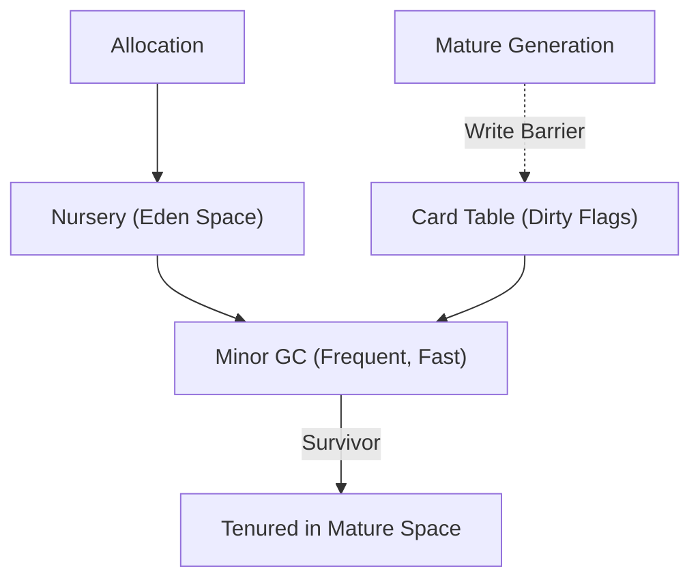

# Generational Garbage Collector with Card Table Skill

High-efficiency, zero-dependency Python implementation of **Generational Garbage Collection with Card Table Write Barriers**.

## Features
- **Weak Generational Hypothesis**: Collects short-lived nursery objects at microsecond latencies without scanning mature heap.
- **Card Table Tracking**: Byte array marking mature-to-young pointer mutations to bound root-scanning overhead.
- **Zero External Dependencies**: Pure Python standard library.
- **Native MCP Protocol**: JSON-RPC 2.0 stdio server compatible with Claude Desktop, Cursor, and Windsurf.

## Architecture

